# Phase 8 checkpoint: Product Compression, Hero Experiences & Private-Beta Readiness

**Status: internal preview only.**
- Nothing is deployed.
- Nothing was purchased.
- The Cricsheet licensing email has **not** been sent.
- No new data source was added.
- Baseline: `48acece` (Phase 7). The Phase 8 commit hash is reported in the hand-over message; a commit cannot contain its own hash.

**What Phase 8 did:** compression rather than new features. Explore became a launcher Home, the player page went from about 11 phone screens to about 5, and Battle, Match, Ask and Play were reordered around the question a fan asks. Every capability that left a first screen is still reachable.

## Gate result (final run, on the final code)

| Check | Result |
|---|---|
| `pytest` | **134 passed**: 128 existing + 6 new in `test_phase8.py` (meetings/halves integrity, role layouts incl. neutral, Home never fakes missing entities, deterministic bounded follow-ups, plain-language findings, tied-name lists) |
| `tsc`, `next build` | pass |
| **Phase 7** journeys (`screenshots-phase7.mjs`) | 0 errors · **0 failed assertions** · 0 px overflow |
| **Phase 2** | 0 errors |
| **Phase 3** | 0 errors |
| **Phase 4** | 0 errors · 0 failed assertions |
| **Phase 5** | 0 errors · 0 failed assertions · **0 spoiler leaks** |
| **Phase 6** (provenance / data-capability) | 0 errors · 0 failed assertions |
| **10 golden journeys** (`golden-phase8.mjs`) | **10/10 pass**, 0 console/network errors, 0 overflow on every screen visited |
| **Accessibility** (`a11y-phase8.mjs`, 15 pages) | **15/15 clean**: no text < 11 px (SVG measured after scaling), no contrast < 4.5:1 (3:1 large), no unnamed controls, no tap target < 24×24, every chart has a text equivalent, one h1 per page, skip link is the first Tab stop, reduced-motion rule present. Repeated 4× because Play draws random moments |
| **Terminology** (`jargon-phase8.mjs`) | **0** technical terms visible by default on Home, Player ×3, Battle, Match, Play, Ask ×2 |
| **Visual regression** (`visual-phase8.mjs`) | baseline captured (`docs/screenshots/phase8-baseline/`); re-capture **8/8 same, 0.000% px** |
| **API budget** | **all 28 endpoints < 500 ms cold** (worst 355 ms); **27/28 < 50 ms warm**; one justified exception (Play next-moment, 58.7 ms) |
| Ask acceptance (`docs/data/ask-acceptance-phase8.txt`) | **13/13** starting questions answer; **23/23** displayed follow-ups execute (questions answer, links return 200); 13/13 keep "How I interpreted your question" |

Not run: no public deployment, no external analytics or feedback service, no licensing email.

**Mid-gate corrections.** Three regression scripts were updated for documented relocations: Phase 2/3/4 Explore → `/discover`; the fingerprint → Style tab; similar battles → `[data-testid=battle-similar]`; partners → Partnerships tab; the battle hero selector. **No assertion was weakened or removed.** The Phase 7 player checks now assert the defining insight, the findings, ≥ 3 stories (after "more stories"), and similar players, petals and matchup discovery on their new tabs.

## Acceptance questions

### First 60 seconds
- **What CRICINTEL does:**
  - The first viewport is a kicker ("Cricket intelligence · ball by ball"), the title "See cricket differently.", and one sentence: "Who really gets whom out, what changes after 30 balls, which battles are lopsided. Every number opens to the deliveries behind it."
  - Then come five real examples, one per hero.
  - No development history, methodology or capability matrix appears.
- **Search:**
  - The box ("Search a player, match or battle") is the first control, at y ≈ 365 px on a 390 × 844 phone.
  - A search icon is in the header of every page, and `/search` exists.
- **Heroes:**
  - The five launch rows are labelled PLAYER / BATTLE / MATCH / PLAY / ASK, each with a real fact (28,118 runs in 687 innings; 425 off 385, out 9; India chasing 160; Zampa and Southee 9 each).
  - The tab bar is Home · Players · Battles · Ask · Play. The Home first viewport has no other features.
- **Licence warning:** a single-line pill ("Internal preview · data licence pending ⓘ") stays on every page and expands on tap. It's visible without dominating.

### Player
- **Shorter than Phase 7?** Yes: Kohli went from 10.9 to 4.7 screens, Bumrah from 10.8 to 4.9 and Mandhana from 10.8 to 4.8. Both builds were measured side by side at 390 px (table below).
- **Role-first?**
  - Kohli (batter) leads with how he gets out.
  - Bumrah (bowler) leads with how the wickets come; no batting-dismissal block is shown.
  - Hardik Pandya (all-rounder) gets both blocks.
  - Dhoni (keeper) gets a keeping strip (516 ct, 199 st).
  - Players under 300 covered balls get the neutral layout.
- **Deeper analytics reachable?**
  - Tabs: Overview · Style · Matchups · Innings · Bowling · Partners · Career · Strengths & weaknesses · Dismissals · When they change · Numbers.
  - "Explore more" links on the overview, plus WHY boxes and deliveries everywhere.
- **Matchup Discovery present?** Yes, at the top of the Matchups tab. The compression had dropped it; final inspection caught that and restored it. A regression asserts it.
- **More Player Stories?** Yes: "N more stories" expands all of them (Kohli has 4 more). Phase 7's ≥ 3-stories assertion passes.

### Battle
- **First viewport:**
  - BATTER v BOWLER across a crease motif.
  - Score strip: 385 balls · 425 runs · SR 110.4 · 9 dismissals.
  - "30 matches · 2016–2025", then "Is this battle unusual?" with the interval.
- **Sample and uncertainty:**
  - A 90% interval for strike rate (100–121) and for dismissals (4.7–15.7).
  - Expected v observed, a sample label ("Reasonable sample for this matchup"), and "* = under 30 balls" in the breakdown.
- **Causality:**
  - The earlier/later split is labelled "Two halves of the same battle, split by balls faced. A difference describes what happened; it is not a trend forecast."
  - When either half is under 60 balls, it says "treat any difference as noise".
  - The edge card says "We don't declare a winner when the evidence is inconclusive."
  - The causal-word guard (Phase 7) still passes.
- **All 30 meetings:** 8 render first; "Show all 30 meetings (oldest first)" reveals all 30. Golden journey J3 asserts 8, then 30.

### Match
- **Story rather than scorecard:**
  - Header (scoreboard, result, venue, player of the match), then "Replay it ball by ball".
  - Then "What made this match interesting": standout innings (Kohli 82* off 53), standout spell (Hardik Pandya 3/30), biggest partnership, battle of the match, records.
  - Then a Play moment, the worm, and factual key events.
  - The scorecard sits below a "Scorecard & details" divider.
- **No invented turning points:**
  - The API still returns "Not shown: CRICINTEL has no validated turning-point algorithm."
  - Key events are defined facts (biggest over, milestones, collapses).
  - The experimental situation-difficulty list is collapsed, labelled EXPERIMENTAL / MODELLED and "Not a validated turning-point measure".
  - No causal narrative appears.
- **Scorecard, replay, evidence:** all reachable. Full scorecards, fall-of-wickets links to each delivery, partnerships, all battles, the replay (J4), and a Play moment (J5).

### Ask
- **All 13 starting questions work:** 13/13 (answers in `docs/data/ask-acceptance-phase8.txt`).
- **Every displayed follow-up executes:**
  - 23/23. Twelve are questions that answer `ok`; eleven are links that return 200.
  - Follow-ups are generated by rules from the intent kind and the answer's own entities (`ask/v1.py::followups`), not by a language model.
- **"How I interpreted your question":** present on every answer (13/13), with removable chips and "Show the pipeline".

### Play
- **Open → prediction controls usable:** **336 ms** median at 390 px (1,060 ms with 4× CPU throttle). First reveal after one tap: 694 ms (1,629 ms throttled). Comfortably under 5 s.
- **No future-ball leakage:**
  - Phase 5 spoiler suite: 0 leaks.
  - Golden J5: no reveal and no onward links before the pick.
  - The `/api/whn/next` payload holds only the situation, the recent (past) balls and the *label* of the next ball (e.g. `4.1`). It has no outcome, probabilities, following balls or result (checked).
  - Scoring is explained only after the first prediction.

### Compression (390 px, fresh visitor; Phase 7 = 48acece built and measured side by side)

| Page | Phase 7 | Phase 8 | |
|---|---|---|---|
| Home (was Explore) | 13.7 screens | **2.7** | −80% |
| Player: Kohli | 10.9 | **4.7** | −57% |
| Player: Bumrah | 10.8 | **4.9** | −54% |
| Player: Mandhana | 10.8 | **4.8** | −56% |
| Battle: Kohli v Zampa | 5.9 | 6.2 | **+6%: not compressed** |
| Match: MCG 2022 | 5.5 | 6.4 | **+16%: not compressed** |
| Ask (empty / answered) | 1.8 / 2.3 | 1.9 / 2.5 | ≈ |
| Play | 1.7 | **1.1** | −35% |

**Compression succeeded for Home and Player. It did not for Battle and Match:** they were reordered so the first viewport answers the question, but they gained sections and are slightly longer. Shortening them is in the backlog. I am not claiming it.

**Removed, collapsed, moved or combined** (full list: `docs/product/phase8-dead-weight-report.md`):
- **Moved to `/discover`:** Explore's daily sections, Today's mix, the discovery grid, Patterns and gateway cards. The duplicate Ask form and chips were removed.
- **Moved to the Style tab:** the fingerprint, every finding and similar players.
- **Moved to the Matchups tab:** Matchup discovery.
- **Collapsed:**
  - Player stories beyond 2 ("N more stories").
  - Battle meetings beyond 8.
  - The match's experimental list.
  - Play's situation detail (in a `
`).
  - Play scoring (now after the first pick).
  - Ask's 27 chips, now 13 grouped questions plus "More questions".
- **Removed:**
  - The battle OutcomeMap section and the story links (story pages demoted: route kept, graph edges removed).
  - The duplicate hero chips.
- **Combined:** Live Lab into Match ("Replay it ball by ball") and Play.
- **Kept at 6, not reduced:** "Explore next". Trialled at 4, the Phase 7 rabbit-hole journeys lost their match and innings hops, so depth wins.

### Visual system
- **No essential text below 11 px.** Checked on 15 pages, including SVG text after scaling. The Worm chart redraws narrower on phones so its axes stay at or above 11 px.
- **Contrast:** `--dim` raised to #7f8ca8 (≥ 4.5:1 on every surface). Recent-ball chips now use full-contrast text, and wicket chips use dark-on-red (6.3:1).
- **Focus:** `:focus-visible` outline on every control.
- **Tap targets:** primary targets are 44 px (picks, Ask questions, actions); none is under 24 px.
- **Navigation:** a skip link is the first Tab stop; `prefers-reduced-motion` disables motion.
- **Text alternatives:** every chart has `role=img` with a text summary (e.g. "Pakistan: 159 runs in 20 overs, 8 wickets; India: …").
- **Rounded cards: still overused in places.** The new motifs (score strip, crease divider, batter-v-bowler, ruled ledgers, hero rules) replaced cards on the Home, the player overview lists, the battle hero, meetings and the Ask questions. Rounded cards remain on:
  - the player hero box;
  - the battle "Who has the edge?" and dismissal-scene cards;
  - the best-performance story cards;
  - the Ask interpretation, answer and number tiles;
  - the Play reveal.

  These are in the backlog; Phase 8 did not restyle them.

### Coverage and names
- **Standard phrases** (`web/lib/coverage.ts`) on the player hero, the Ask kicker, the battle empty state and the match note.
- The engine's 7 generated "in our covered data" phrases now say "in covered matches", so an Ask answer and its kicker match.
- **Initials-only names:** about 4,800 (4,806 by the "initials + surname" rule over 8,469 resolved players). **None guessed.** What source would fix it is in `docs/data/full-names-investigation.md`.
- **Aliases within one journey:** the API responses along the Kohli → Zampa → MCG → Mandhana journeys were scanned for every displayed form of each name.
  - Two raw scorecard strings were found and fixed: the player of the match (fixed earlier in Phase 8) and the match page's experimental rows ("V Kohli" → "Virat Kohli").
  - The remaining "V Kohli" appears only as the labelled register alias in the profile's metadata ("also recorded as").
  - Replays already used register names.

### Session memory
- Returning to Home shows "Continue where you left off" (3 rows after 3 visits).
- "Clear my history" removes `ci-memory-v1`; the section stays gone after a reload.
- **Stored:** only `{id, type, label, href, ts}` for public cricket entities plus Play totals, under the keys `ci-memory-v1` and `ci-preview-notice`.
  - No free text, no identifiers and no analytics buffer (that is written only when a developer sets `ci-dev-analytics=1`).

### Analytics and feedback
- **Specification and local prototype only:** `docs/product/beta-analytics-and-feedback.md`, with 13 events and 9 metrics. Queries are logged as intent kind and length, never as text.
- **No external service is connected**, and nothing leaves the browser.
- The feedback UI (👍 / 👎 / "Something wrong with a stat?") is on Player, Battle and Match and saves to the browser only.

### Regression
- Phase 2–7 functionality is intact (results above).
- Phase 5 spoiler suite: 0 leaks.
- Phase 6 provenance and data-integrity safeguards: 0 failed assertions.
- Provenance tags, WHY boxes, intervals, minimum samples, multiple-comparison protection and "Historical replay, not live" are all still present.

## Performance

**API**, from `docs/data/benchmarks-phase8.json` (the final run, after warm-up reported complete):
- All 28 endpoints are under 500 ms cold.
- 27 of 28 are under 50 ms warm.

**Changes made**, each profiled first:
- **Player profile:** warm 242 → 3.5 ms, via a bounded response memo. Historical data is static between builds; the memo is cleared on restart.
- **Battle:** warm 191 → 3.0 ms, same memo.
- **Play next-moment:** warm 137 → 58.7 ms.
  - Its delivery lookup scanned all 3.3M balls; adding the match-id prefix (0 exceptions in 3,298,136 balls) lets DuckDB prune.
  - A second rewrite (bowler figures) was rejected: it saved about 8 ms but risked double-counting on 24 deliveries.
- **Monitoring:** a new `/api/health` reports when warm-up has finished.

| Key endpoint | Cold ms | Warm ms |
|---|---|---|
| Home | 8.2 | 3.5 |
| Battle meetings (not pre-warmed / Kohli v Zampa) | 28.4 / 23.9 | 3.5 / 4.8 |
| Ask with follow-ups | 49.4 | 41.5 |
| **Play next moment** | 104.4 | **58.7 (exception)** |
| Player home (not pre-warmed) | 349.9 | 4.6 |
| Compare V2 (Bumrah v Starc) | 355.1 | 3.8 |
| Reference: player profile | 239.0 | 3.5 |
| Reference: battle | 124.7 | 3.0 |
| Reference: match | 332.5 | 4.9 |

The full table is in `docs/product/phase8-performance-budget.md`.

**Justified exception (Play next-moment, 58.7 ms warm):**
- Every request draws a new random moment by design, so "warm" is still a fresh computation.
- Caching or a precomputed pool would change the random draw just to meet a synthetic number.
- The UI prefetches the next moment during each reveal.
- The user-facing measure is controls usable at 336 ms.

**Page render** (390 px, median of 3 fresh loads, navigation → hero element):

| Page | Unthrottled | 4× CPU throttle |
|---|---|---|
| Home | 281 ms | 1,148 ms |
| Player | 432 ms | 1,329 ms |
| Battle | 437 ms | 1,546 ms |
| Match | 350 ms | 1,364 ms |
| Ask answer + follow-ups | 398 ms | 1,142 ms |
| **Play controls usable** | **336 ms** | 1,060 ms |
| Play first reveal | 694 ms | 1,629 ms |

**Bundles:** shared 102 kB (unchanged); every hero route is ≤ 139 kB First Load JS (Phase 7: ≤ 137 kB). No new dependency.

## Defects found during final screenshot inspection (all fixed unless noted)

1. The Home title "DIFFERENTLY" clipped at 390 px.
2. Play situation strip: the phase and batter cells overlapped.
3. Ask number tiles were cramped in 4 columns on a phone (now 2).
4. Play: the "MODEL" tag overflowed the screen edge in the 7-column pick row.
5. Recent-ball chips: 4.39:1 contrast (muted text on tinted backgrounds).
6. Ask: a 4-way tie read "Dale Steyn and Chris Woakes and Umesh Yadav and Morne Morkel". It is now "Dale Steyn, Chris Woakes, Umesh Yadav and Morne Morkel"; both code paths are fixed and a test was added.
7. Match experimental rows showed raw scorecard names ("V Kohli").
8. Ask showed two coverage phrases in one card.
9. Bumrah: an "Explore next" reason said "(7th v 10th percentile)". It now reads "… (7 and 10 on a 0–100 scale against peers)".
10. Matchup Discovery had silently dropped out of the player page; restored on the Matchups tab.
11. The battle-icon glyph "⚔" renders as "×" in this container's headless Chromium, which has no emoji font. Fixed on Battle's similar rows (now "→"). **Not changed** on other Phase 7 surfaces: it renders correctly where an emoji font exists, so it is logged as an environment issue.

## Remaining known issues (post-Phase-8 backlog; none are gate failures)

- Battle (6.2 screens) and Match (6.4) are not shorter than in Phase 7. Candidates: collapse the breakdown table, the scorecards and the all-battles list by default.
- Rounded cards remain on the surfaces listed under the visual system.
- `/discover` ("Everything we found") is 14.2 screens. It is a secondary, opt-in page, but still long.
- Copy: "best covered innings in covered matches" is redundant.
- The tab bar highlights **Home** on match, record and competition pages. This is deliberate (Match lives under the launcher), but it may confuse; revisit with beta feedback.
- The ⚔ glyph depends on an emoji font (see defect 11).
- The return-session metric needs a persistent anonymous ID and a consent design; not built.
- Feedback and analytics are browser-local prototypes.
- The visual baseline and golden journeys are scripts, not wired into CI.

## Private-beta blockers (`docs/product/private-beta-readiness-checklist.md`)

1. **Cricsheet licence for showing data to people outside the team: HARD GATE, open.** The email is drafted and **not sent**.
2. Hosting and access control for a private beta: not started.
3. Privacy notice and consent before any analytics sink; feedback inbox: designed only.
4. The full-names decision (57% initials-only), tied to the licence and data-provider decision.

## Screenshots (390 px phone unless marked)

Final screens are in `docs/screenshots/phase8/` (`m-*` = phone first viewport, `m-*-full` = full page, `d-*` = desktop 1280 px). The visual baseline is in `docs/screenshots/phase8-baseline/`.

| | |
|---|---|
| Home | 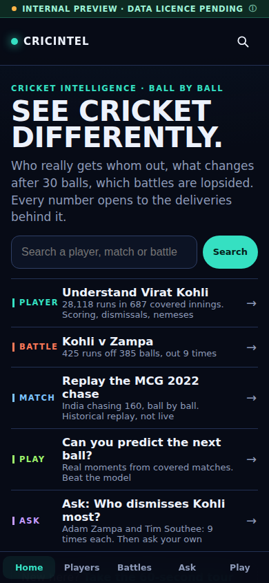 |
| Home, returning ("Continue where you left off") | 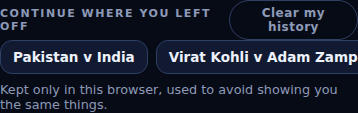 |
| Tour, step 1 | 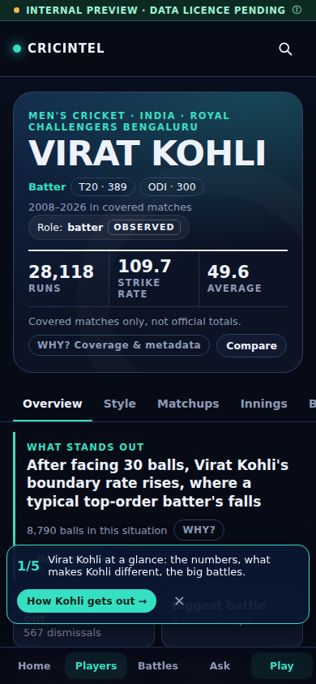 |
| Player: Kohli (batter) | 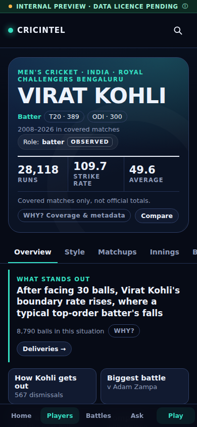 |
| Player: Bumrah (bowler), full | 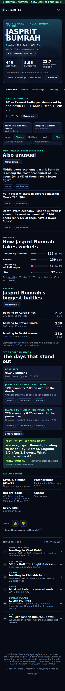 |
| Player: Hardik Pandya (all-rounder), full | 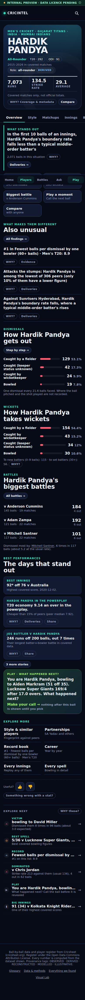 |
| Player: Dhoni (keeper) | 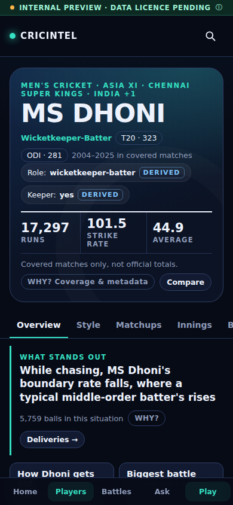 |
| Battle: Kohli v Zampa | 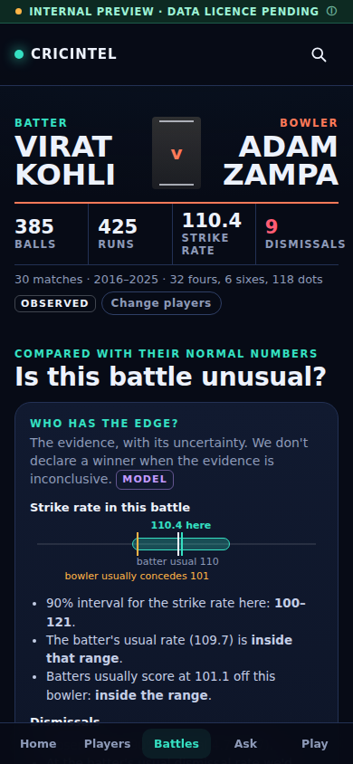 |
| Match: MCG 2022 | 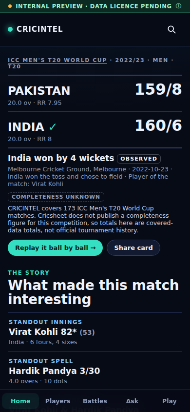 |
| Ask: empty | 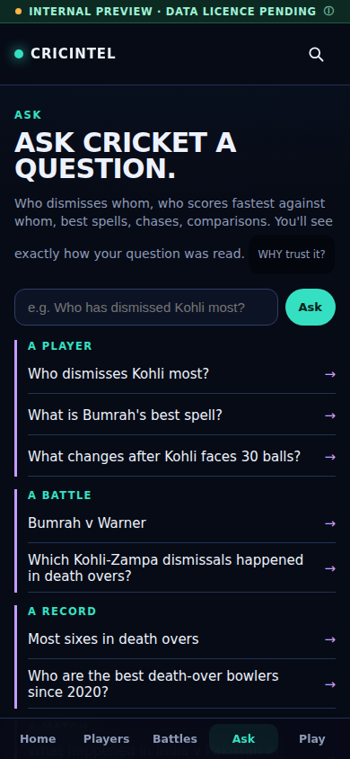 |
| Ask: answer + follow-ups, full | 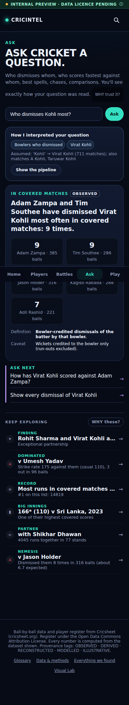 |
| Play: first screen | 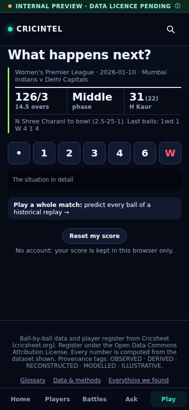 |
| Play: after the first prediction | 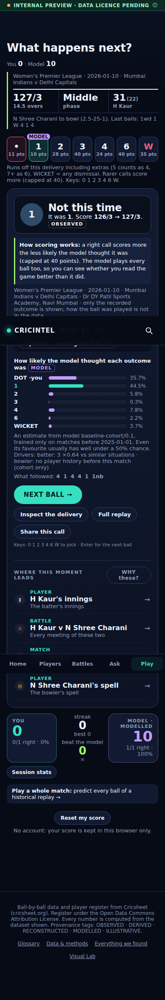 |
| Desktop: Home | 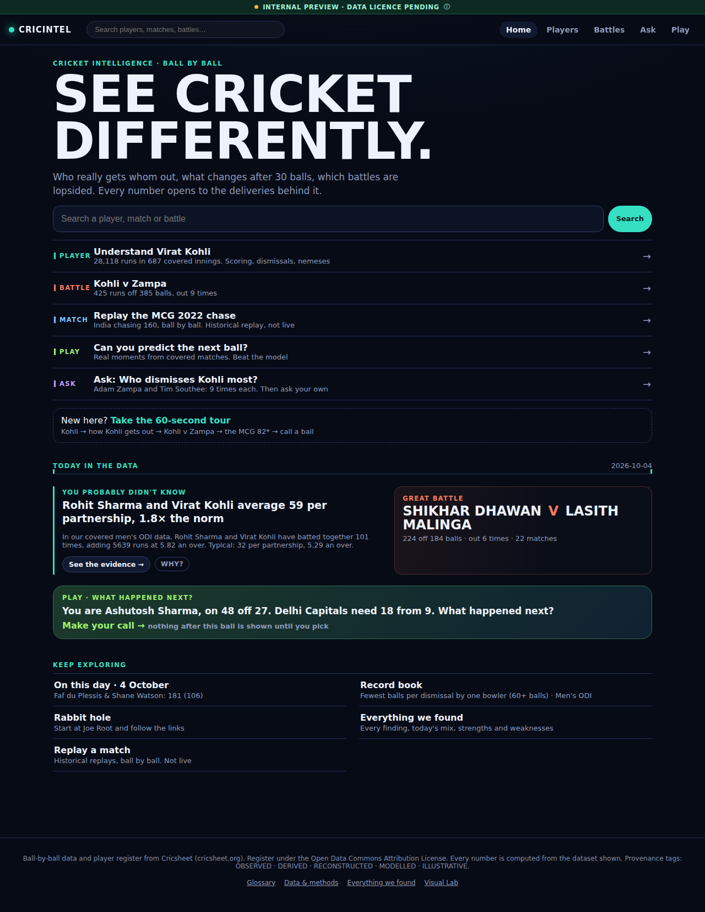 |
| Desktop: Battle | 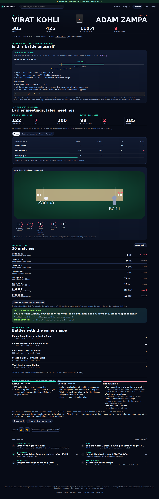 |
| Desktop: Match | 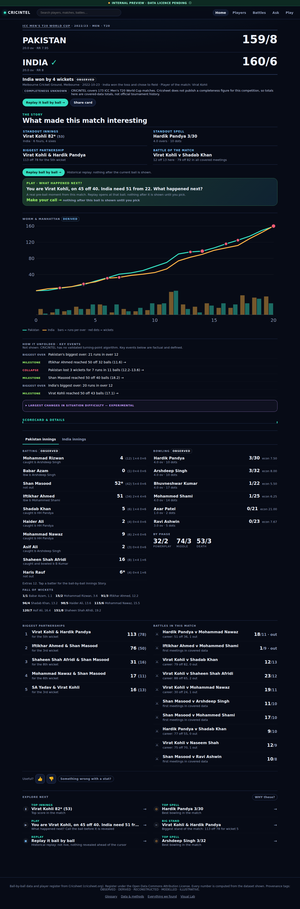 |
| Desktop: Player (baseline) | 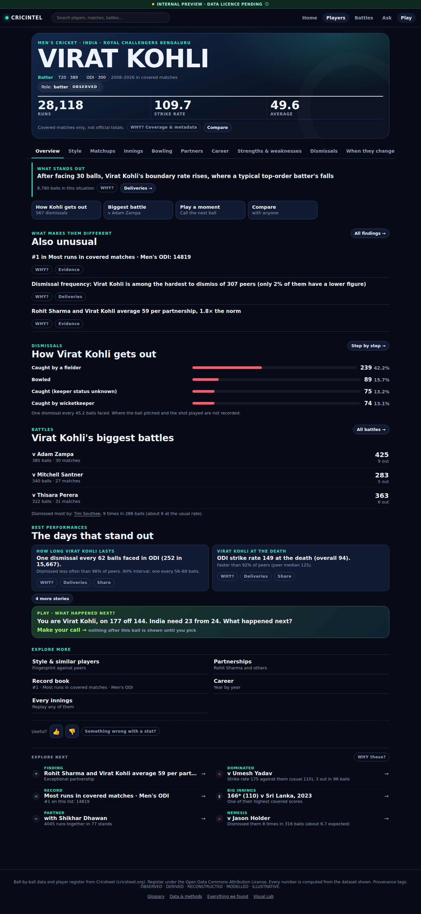 |
| Desktop: Match Centre replay (baseline) | 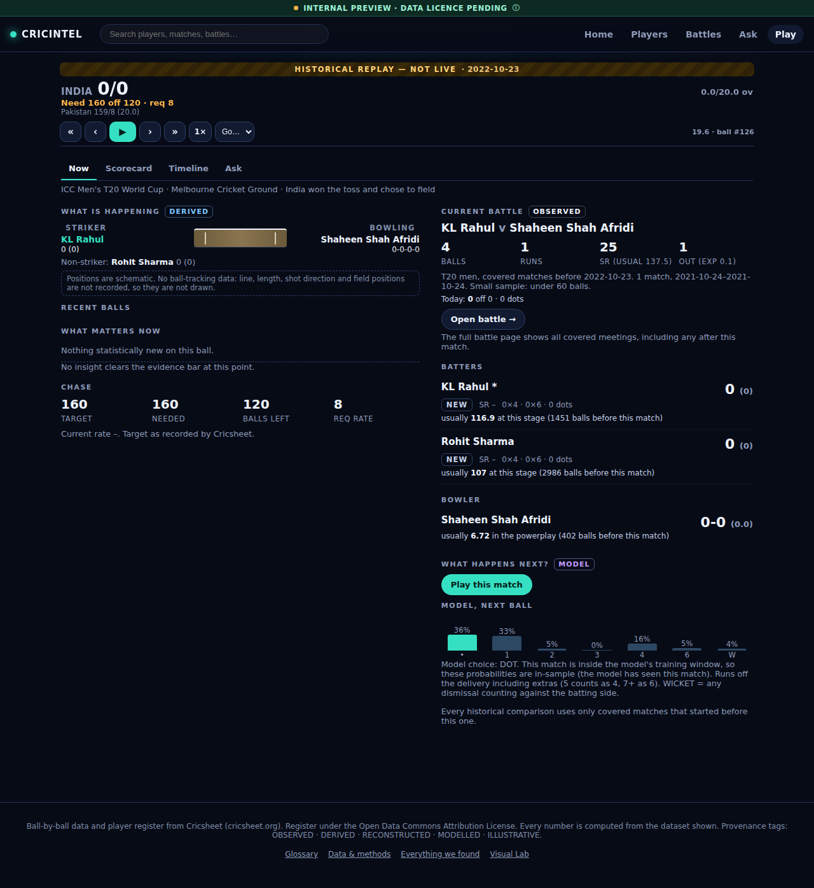 |

## The 22 deliverables: where each one is

| # | Deliverable | Location |
|---|---|---|
| 1 | Product-compression audit | `docs/product/phase8-compression-audit.md` |
| 2 | Final hero-experience architecture | `docs/product/phase8-hero-architecture.md` |
| 3 | First-60-seconds experience | `web/app/page.tsx`, `fan/home.py`, `/api/fan/home` |
| 4 | Optional guided journey | `web/lib/tour.ts`, `components/TourBar.tsx` (5 steps, dismissible, remembered locally) |
| 5 | Compressed Player | `components/fan/PlayerHome.tsx` |
| 6 | Role-adaptive Player | `fan/player.py::hero` (`layout`), architecture doc |
| 7 | Battle hero redesign | `web/app/battle/page.tsx`, `fan/battle.py`, `/api/fan/battle/meetings` |
| 8 | Match story redesign | `web/app/match/[id]/page.tsx` |
| 9 | Ask follow-ups | `ask/v1.py::followups`, `web/app/ask/page.tsx` |
| 10 | Sub-5-second Play | `web/app/play/page.tsx` (336 ms to controls) |
| 11 | Visual system | `docs/design/visual-system.md`, `globals.css` Phase 8 block |
| 12 | Accessibility / typography | `scripts/a11y-phase8.mjs` (15/15) |
| 13 | Terminology / glossary | `docs/product/terminology-and-coverage.md`, `web/lib/glossary.ts`, `/glossary` |
| 14 | Coverage language | `web/lib/coverage.ts`, same doc |
| 15 | Compressed Explore | Home launcher + `/discover` |
| 16 | Dead-weight report | `docs/product/phase8-dead-weight-report.md` |
| 17 | Analytics specification | `docs/product/beta-analytics-and-feedback.md`, `web/lib/analytics.ts` |
| 18 | Feedback specification | same doc, `web/lib/feedback.ts`, `components/Feedback.tsx` |
| 19 | 10 golden journeys | `scripts/golden-phase8.mjs` (10/10) |
| 20 | Visual-regression baseline | `scripts/visual-phase8.mjs`, `docs/screenshots/phase8-baseline/` (8/8) |
| 21 | Performance-budget report | `docs/product/phase8-performance-budget.md`, `docs/data/benchmarks-phase8.json` |
| 22 | Private-beta readiness checklist | `docs/product/private-beta-readiness-checklist.md` (prepared, not executed) |
